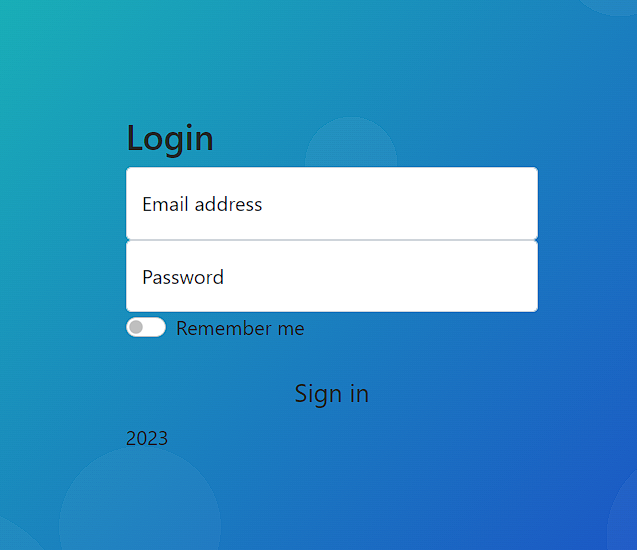
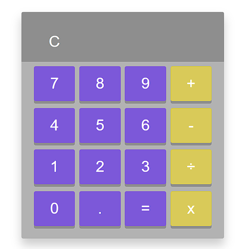

# Гит для практик и лабораторных работ по дисциплне Спец ПО реального времени

### Практика №1
Знакомство с основами языка JS [Pr1](./Pr1/Test.js)

### Практика №2
Создание авторизующей формы на HTML + CSS [Ссылка на файл](./Pr2/test.html)

### Практика №3
Создание собственного калькулятора на основе HTML и CSS  [Ссылка на файл](./Pr3/index.html)

